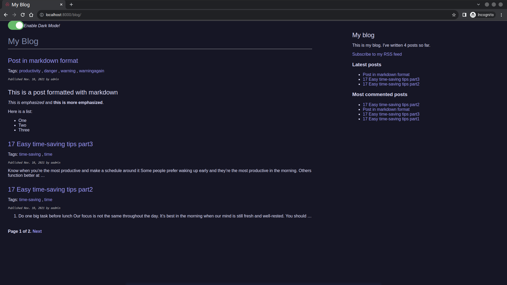
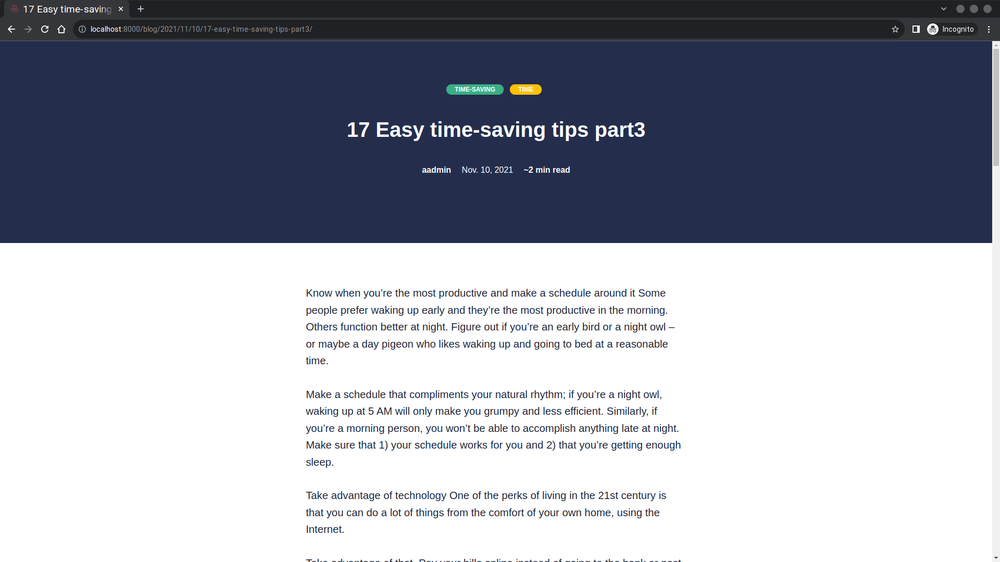

## Technologies Used in educa

### Back-end

### Front-end

# Personal-Blog

My Blog site in Django

## Project Preview

## QuikStart

- Create a Virtual environment

    `python3 -m venv .venv`

- Activate the Virtual environment

    `source .venv/bin/activate`

- Install required packages

    `pip3 install -r requirements.txt`

- Run Migration for Models

    `python3 manage.py migrate --settings=mysite.settings.local`

- Start Development Server

    `python3 manage.py runserver --settings=mysite.settings.local`

## Setting Up Your Users

- To create a normal user account, just go to Sign Up and fill out the form. Once you submit it, you'll see a "Verify Your E-mail Address" page. Go to your console to see a simulated email verification message. Copy the link into your browser. Now the user's email should be verified and ready to go.

- To create an superuser account, use this command:

  `$ python manage.py createsuperuser`
  
### Devevelopment envirionment

### Contributors

